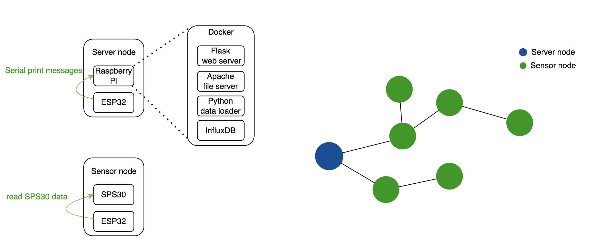
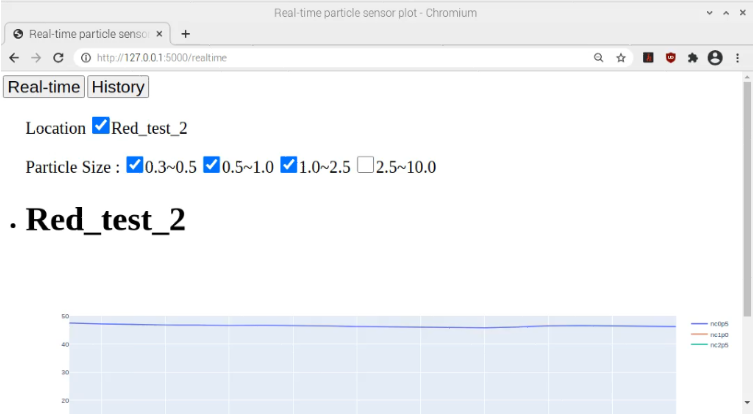
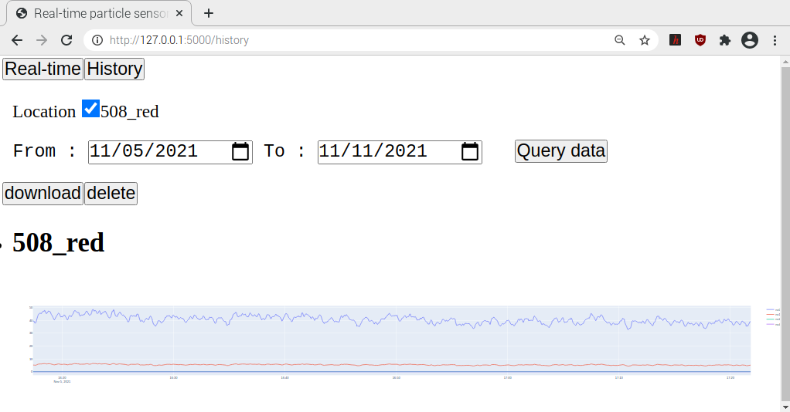

# AU PaC
將Particle sensor資料透過ESP-WiFi-Mesh進行收集，並透過Python Flask呈現Particle的趨勢

 

## 安裝說明

* ESP-MDF ( Espressif Mesh Development Framework )

    1. 安裝環境
        * [ESP-MDF](https://github.com/espressif/esp-mdf) 環境建置

        
    2. ESP Node 燒錄
        * esp_file/asRoot

            ` idf.py menuconfig `

            修改 
            
            > `AU PaC Configuration > Mesh ID` → Mesh網路 ID
            

            ` idf.py flash`
                
        * esp_file/asNonRoot

            `idf.py menuconfig`
            
            修改
            > `AU PaC Configuration > Mesh ID` → Mesh網路 ID  
            > `AU PaC Configuration > Location` → 節點位置
                
            
            `idf.py flash`

* 樹莓派設定

    1. 下載及安裝 Docker、Docker-compose  // 若有安裝可略過
        
        `sudo apt update && sudo apt install -y docker docker-compose`
        
        `sudo usermod -aG docker $USER`
    
        
    2. 啟動應用程式
        
        在專案資料夾終端機中執行
        
         `docker-compose up` 
        
    
## 網頁操作

* Real-time
    
    勾選想觀察的節點及粒徑大小

    
        
* History
        
    提供查詢、下載、刪除歷史資料

    